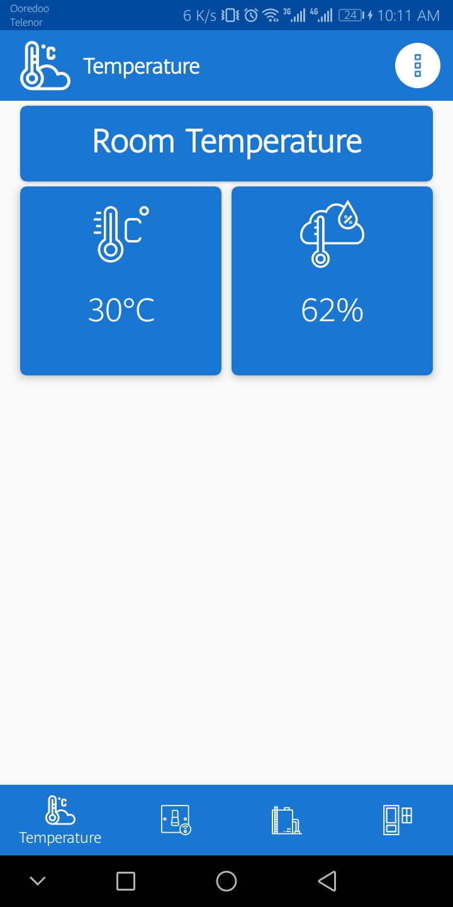
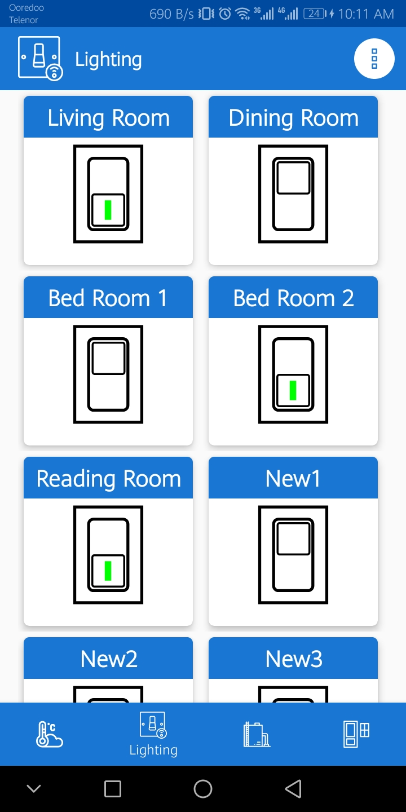
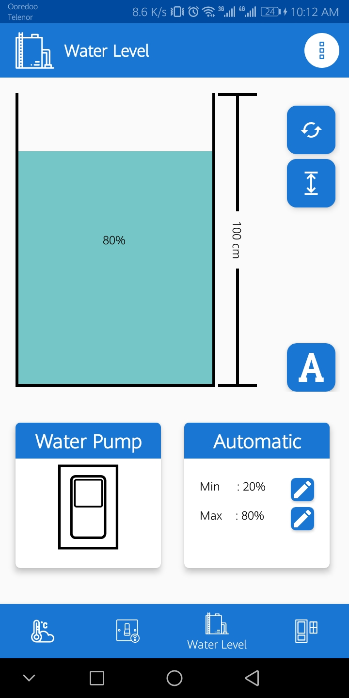
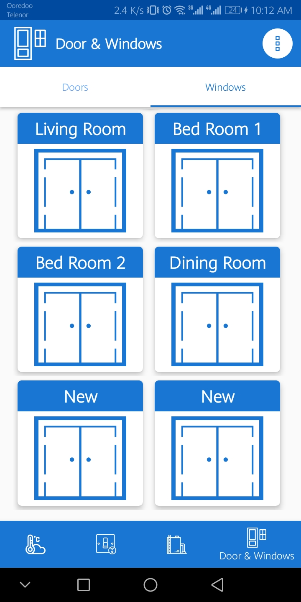

# IHome (Home Automation IoT) :iphone:
> This project was created with PHP,HTML5,CSS3,JQuery,JOSN and MYSQL.
> IOT(Internet Of Things) Home Automation System
# Features
- Monitoring sensors status and values.
- Controlling electronic appliances ( lighting,TV,Watering Pump,etc... ).
- Monitoring & Controlling the water tank and pump.
- Monitoring Door and Window which one is opened.

 |
 |
 |

### Developed by Nay Lin Aung :trollface:
### :love_letter: Email - naylinaung.nla.xo@gmail.com
### :phone: Phone - 09775541794
